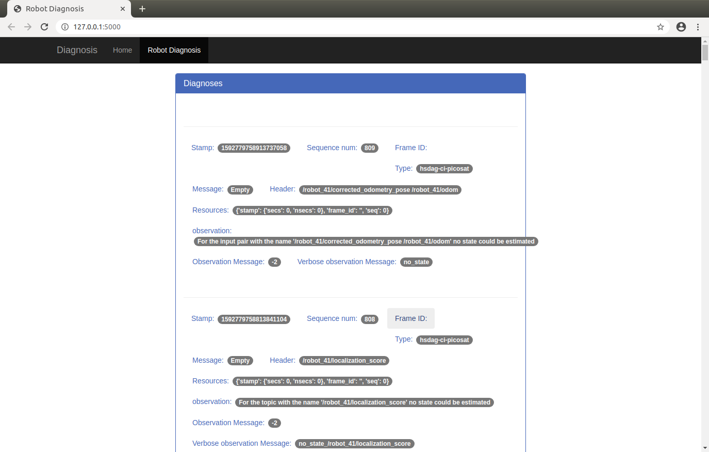

## Integrate a framework for model-based robot diagnosis with an in-house web application for robot operation monitoring 
### Model-based Robot Diagnosis 

Model based diagnosis system implements a fault diagnosis and repair system using ROS based roobt systems. The diagnosis systems consists of the modules such as set of observers, model server, diagnosis engine, repair engine and hardware diagnosis board. All these modules work together for obtaining the diagnosis of the system.

This webpage provides a view of the various diagnosis analysis performed. 


## Robot diagnosis

<p align="center">
  <br><br>
  <br>
</p>


## Prerequisites

Software needed to run this repository:

- [Ubuntu 16.04](https://ubuntu.com/download/desktop)
- Python 2.7 / 3.6

## Installation
**Note 1:** To use this application, ROS should be installed in your system.

### ROS

Follow the steps from 1 to 1.7 in this tutorial to install [ROS Kinetic](http://wiki.ros.org/kinetic/Installation/Ubuntu) in Ubuntu 16.04.


### Clone repository and install requirements

Clone this repository in your computer

```
git clone "https://github.com/HBRS-SDP/model-based-diagnosis.git"
```

This will create a folder called ```model-based-diagnosis``` where all the packages required to run this software will be stored.

Install requirements in python environment
```
pip install -r requirements.txt
```

## Run

Open a terminal and do

```
roscore

```
In another terminal do
```
cd tug_examination/tug_reporter/launch
roslaunch test.launch
```
in another terminal do
```
cd tug_diagnosis/tug_diagnosis/launch
roslaunch diagnosis_anna.launch
```
In another terminla do 
```
cd tug_observers/tug_observers/launch/anna
roslaunch observer_cpp_anna.launch
```
In another teminal do
```
cd tug_diagnosis/tug_diagnosis/scripts
python rosCommunicator.py
```
In another terminal do
```
cd tug_diagnosis/tug_diagnosis/scripts
sqlite3 diagnoses.db < data.sql
```
This creates data base.

In another terminal do
```
cd model_based_diagnosis/tug_diagnosis/tug_diagnosis/scripts
python run.py
```

After this, you should see a message in terminal saying 
* Running on http://127.0.0.1:5000/ (Press CTRL+C to quit)
* Restarting with stat. This means that the application is running properly. 

A local host has been created at ```http://127.0.0.1:5000/```. Go to that page in your browser. Then you will be able to see the webpage displaying the observation messages and diagnosis messages.

## Built With

* [Flask](https://www.palletsprojects.com/p/flask/) - Web framework
* [Sqlite3](https://www.sqlite.org/index.html) - Creating database

##  Authors 

- [Amine Bahlouli](https://github.com/amine789)
- [Anna Rose Johny](https://github.com/annajohny)
- [Chandrika Sundakampalayam Paramasivam](https://github.com/ChandrikaSP)

